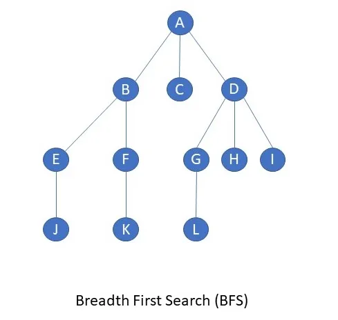

# BFS (Breadth First Search) Algorithm

The breadth-first search (BFS) algorithm is used to search a tree or graph data structure for a node that meets a set of criteria. It starts at the tree’s root or graph and searches/visits all nodes at the current depth level before moving on to the nodes at the next depth level. Breadth-first search can be used to solve many problems in graph theory.

